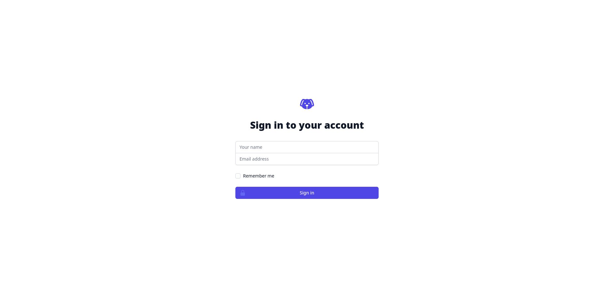
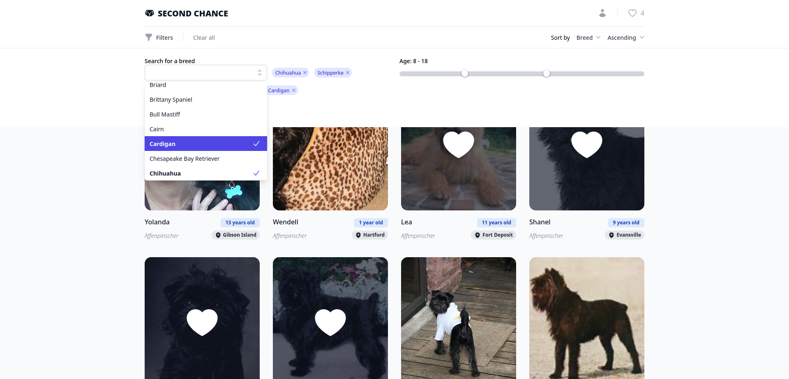
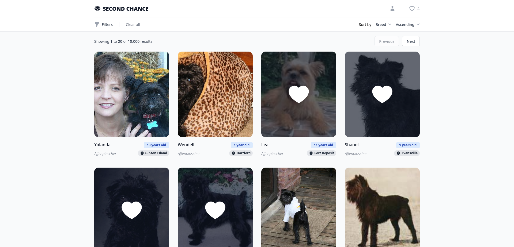
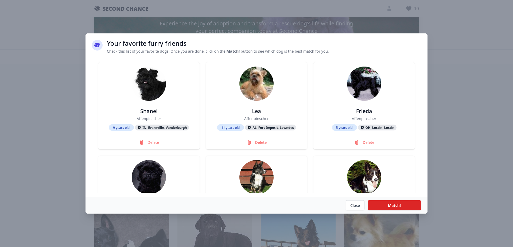
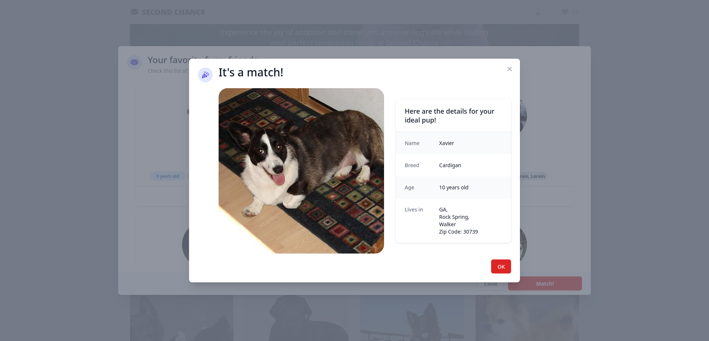
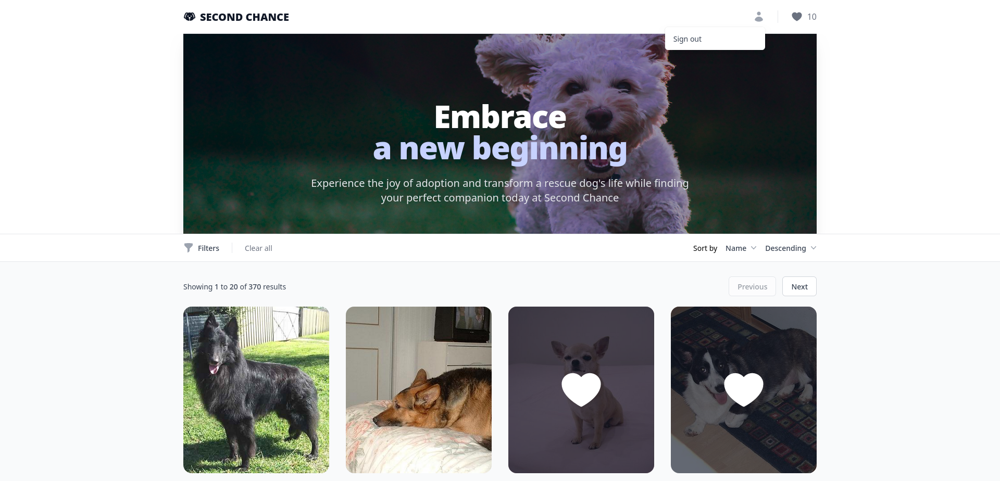

# QuickStart

## Login

Go to the main site, you will see the login page. Enter your name and email

## Main page

Once you are logged in you will see the main page. Here you can see a a grid with info about the dogs.

## Filter dogs

You can filter the dogs by breed or age. Click on the `Filters` button. Type on the search breed element to find a breed. Use the slider to adjust the age range. Click on the `Apply` button to apply the filters. You can also sort the results by name, age or breed.

## Add a dog to favorites

Click on a dog image to mark it as favorite. You can see the dog marked with a heart.

You can see how many dogs you have marked as favorite on the top right corner.

## See your favorites

Click on the _heart_ button on the top right corner to see your favorite dogs. You can delete a dog from your favorites by clicking on the `Delete` button. To add more dogs to your favorites close the modal and click on the heart icon on the dog image.

## Find a match

Ready to find a match? Open your favorites and click on the `Match!` button. Once your match is found you will see a modal with the dog that matches you.

## Sign out

You can sign out by clicking on the _user_ icon on the top right corner, then click on the `Sign out` button. You will be redirected to the login page.

